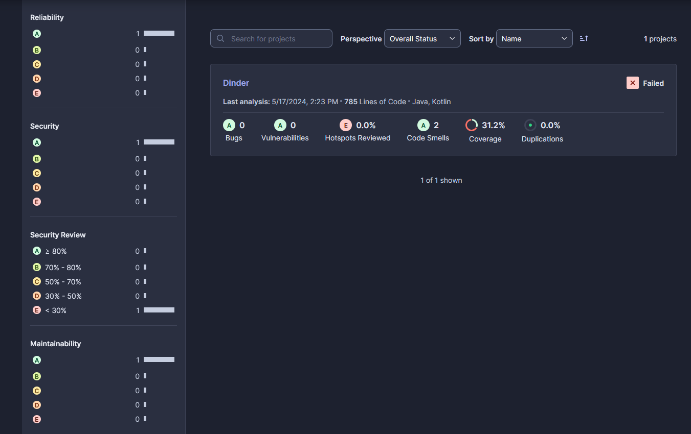

# Software-Metriken

Da wir Sonarcloud verwenden, um unseren Code statisch analysieren zu lassen, haben wir uns für drei Metriken von Sonar entschieden.
Diese Metriken müssen dann auch für die Endversion erfüllt sein. Wir haben uns für die Metriken von Sonar entschieden, da wir diese sehr einfach verfolgen können.

Wir haben uns für die folgenden Metriken entschieden:
- Reliability
- Security
- Maintainability

Dabei haben die Metriken den Wertebereich von A (am besten) bis E (am schlechtesten). Die genaue Definition kann unter der [SonarCloud-Dokumentation](https://docs.sonarsource.com/sonarcloud/digging-deeper/metric-definitions/) nachgelesen werden. Eine wünschenswertes Szenario für die Abgabe wäre somit ein A in allen drei Metriken. 

Wenn diese Metriken erfüllt werden, gibt dies einen Indikator, dass keine großen Fehler in Bezug auf Sicherheit, Zuverlässigkeit und Wartbarkeit gemacht wurden. Dennoch sind diese Metriken nicht eine 100%ige Garantie, dass die Software in all diesen Punkten korrekt ist.

Aktueller Stand bezüglich der Code-Qualität:

# Status-Report

## Backend
- Es wurden weitere Tests für den User Controller geschrieben, diese werden mit der Bibliothek REST Assured realisiert
- Mehrere Pipeplines erstellt, die den Frontendcode formatten und linten
