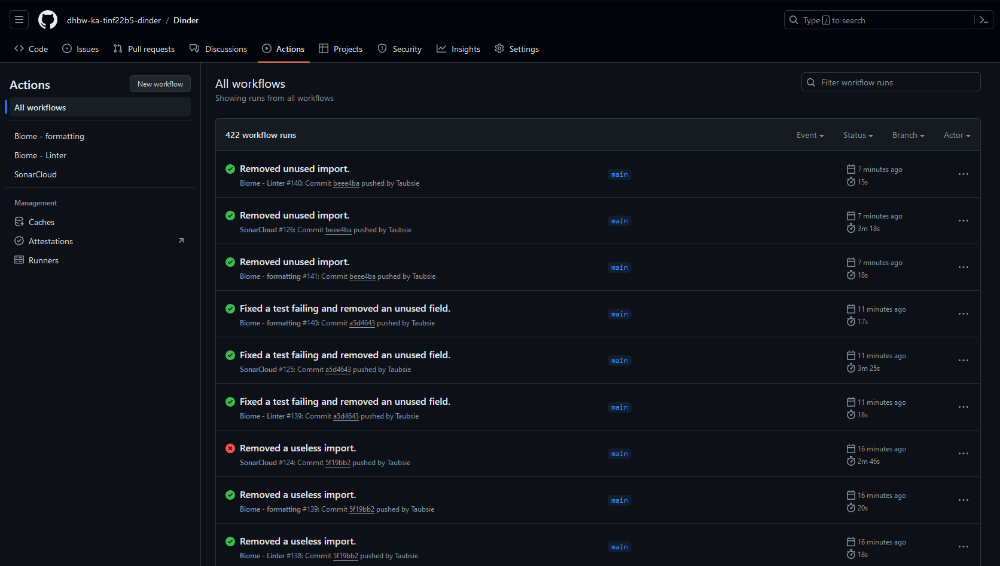

# CI/CD

In unserem Projekt verwenden wir verschiedene Pipelines. Diese Testen den Code und kompilieren den Quellcode zu einer ausführbaren Anwendung.

## Pipeline (grobe Beschreibung)
Um die Code Qualität im Frontend zu verbessern wurde eine Pipeline erstellt, die Biome ausführt.
Biome ist ein Tool zur statischen Code Analyse. Diese Pipeline lintet den Source Code und gibt die Fehler/Verbesserungen als Bericht in der Pipeline aus.
Außerdem wird Biome in einer anderen Pipeline verwendet, um den Frontend Code automatisch bei einem push zu formatieren.

Um die Code Qualität im Backend zu analysieren wurde eine Pipeline entwickelt, die SonarCloud ausführt. Diese wird bei einem Push oder Merge Requests auf *main* ausgeführt.
Hierbei werden die im Backend geschriebenen Tests ausgeführt und zusammen mit der Code Analyse von SonarCloud in SonarCloud angezeigt.

Nach erfolgreichem durchlaufen der geschriebenen Test wird automatisch ein Artefakt in GitHub Actions gebaut.
Bei einem fehlerhaften Test wird ein Fehler in der Pipeline angezeigt und die Artefakterstellung wird abgebrochen.
Der Pipelineersteller wird daraufhin durch eine Email benachrichtigt.
Nach einer erfolgreichen Artefaktbildung kann das Artefakt in der jeweiligen Pipeline im Anhang heruntergeladen werden.

## Konfigurationen
Unsere Pipelines sind auf [GitHub](https://github.com/dhbw-ka-tinf22b5-dinder/Dinder/tree/main/.github/workflows) zu finden:
- Automatischer Formatter: [biome-formatter.yml](https://github.com/dhbw-ka-tinf22b5-dinder/Dinder/blob/main/.github/workflows/biome-formatter.yml)
- Biome Linter: [biome-linter.yml](https://github.com/dhbw-ka-tinf22b5-dinder/Dinder/blob/main/.github/workflows/biome-linter.yml)
- SonarCube + Build: [build.yml](https://github.com/dhbw-ka-tinf22b5-dinder/Dinder/blob/main/.github/workflows/build.yml)

## Genauerer Blick auf die SonarCloud Pipeline
Im Folgenden werden die einzelnen Steps der SonarCloud Pipeline beschrieben:

| Pipeline Stufe            | Zweck                                                                                                                                                                                                             |
|---------------------------|-------------------------------------------------------------------------------------------------------------------------------------------------------------------------------------------------------------------|
| GIT CHECKOUT main         | Es wird der *main* branch ausgecheckt, ausgelöst durch einen Push oder Merge Request.                                                                                                                             |
| Set up JDK 17             | In diesem Schritt wird auf der virtuellen Maschine der Pipeline Java für das Kompilieren des Backends installiert.                                                                                                |
| Set up Node.js            | In diesem Schritt wird auf der virtuellen Maschine der Pipeline Node.js installiert, was für das Kompilieren des Frontends benötigt wird.                                                                         |
| Cache SonarCloud packages | Im Cache gespeicherte SonarCloud packages werden geladen.                                                                                                                                                         |
| Cache Gradle packages     | Im Cache gespeicherte SonarCloud packages werden geladen.                                                                                                                                                         |
| npm ci                    | In diesem Schritt werden die npm-Packages, die für das Kompilieren des Frontends benötigt werden, installiert.                                                                                                    |
| Build Frontend            | In diesem Schritt wird der Next.js Source Code kompiliert.                                                                                                                                                        |
| Build and analyze         | In diesem Schritt wird SonarCloud gestartet. Dabei führt SonarCloud eine Analyse des Backend-Quellcodes durch und führt die Tests aus. Zudem wird die Coverage berechnet und in einem JaCoCo-Bericht gespeichert. |
| Upload build artifacts    | Es wird das kompilierte Backend mit Bibliotheken als Artefakt in der Pipeline hochgeladen.                                                                                                                        |

## Pipeline Status

Der Status der einzelnen Pipelines kann in GitHub angeschaut werden.
Es wird auch verkürzt mit einem grünen Haken bzw. mit einem roten Kreuz angezeigt, ob es fehlgeschlagene Pipelines gab.

Um noch genauere Informationen zu erhalten kann sich der Verlauf der Pipelines über mehrere Commits unter Actions angeschaut werden.

