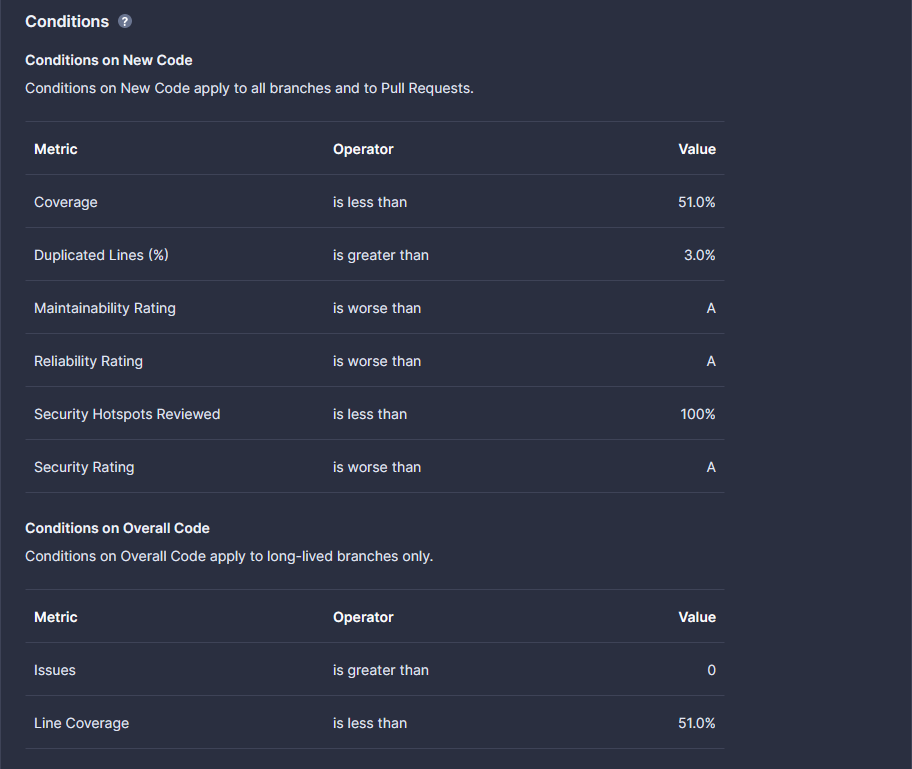
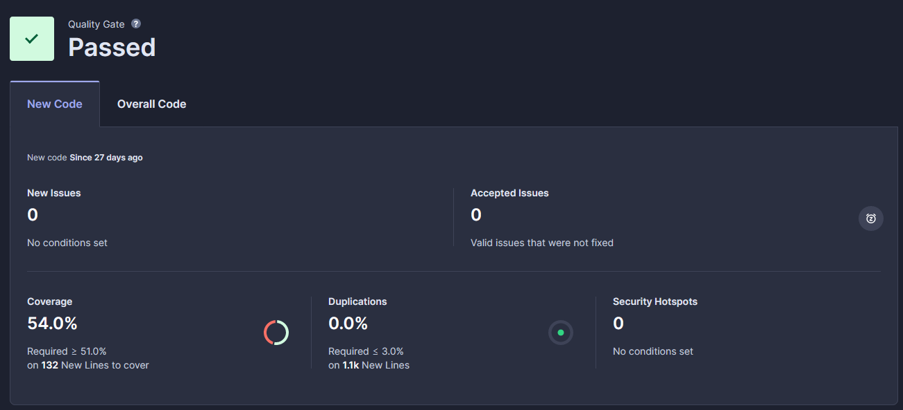
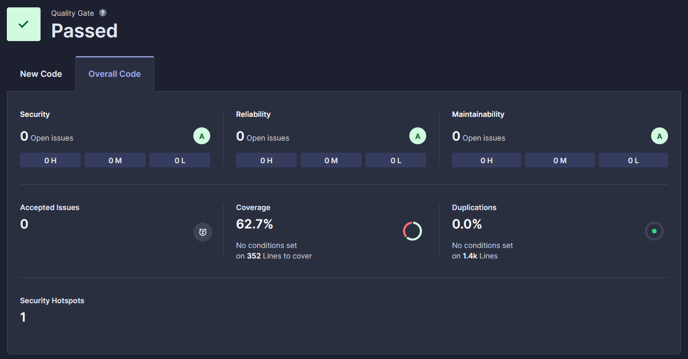
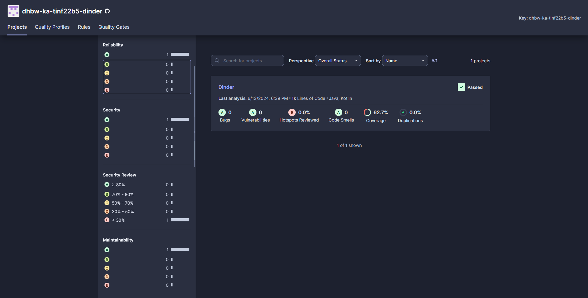

## Metriken

Unsere Software entspricht den Qualitätsstandards, wenn alle Metriken, die von den SonarCloud Quality Gates definiert sind, erfüllt werden.
Dies gilt vor allem für das Java-Backend. Aufgrund der knappen Zeit und der Exmatrikulation eines Teammitglieds konnten für das Frontend keine Tests geschrieben werden.
Um dennoch einen Anhaltspunkt der Frontend-Qualität zu bekommen, wird gefordert, dass der Biome-Linter keine Fehler findet. Dies ist natürlich eine sehr rudimentäre Art von Qualitätsmetriken.

### SonarCloud Metriken

Da wir Sonarcloud verwenden, um unseren Code statisch analysieren zu lassen, haben wir uns für drei Metriken von Sonar entschieden.
Diese Metriken müssen dann auch für die Endversion erfüllt sein. Wir haben uns für die Metriken von Sonar entschieden, da wir diese sehr einfach verfolgen können.

Die von uns ausgewählten Kriterien sind:
- Reliability
- Security
- Maintainability

Dabei haben die Metriken den Wertebereich von A (am besten) bis E (am schlechtesten).
Die genaue Definition und Berechnung der einzelnen Metriken kann unter der [SonarCloud-Dokumentation](https://docs.sonarsource.com/sonarcloud/digging-deeper/metric-definitions/) nachgelesen werden.
Unser Code erfüllt alle diese Kriterien mit einem A.

### Quality Gates

Zu den Metriken von SonarCloud wurden eigene Quality Gates erstellt, die die Qualität sicherstellen soll.
Diese sind im Folgenden aufgelistet:

Die Quality Gates sind aufgeteilt in New Code und Overall Code. Zur Abgabe erfüllt der Quellcode alle Metriken für New Code, sowie Overall Code.

#### Übersicht des New Code Statuses

#### Übersicht des Overall Code Statuses

### Anmerkung zu den Metriken

Wenn diese Metriken erfüllt werden, gibt dies einen Indikator, dass keine großen Fehler in Bezug auf Sicherheit, Zuverlässigkeit und Wartbarkeit gemacht wurden.
Dennoch sind diese Metriken nicht eine 100%ige Garantie, dass die Software in all diesen Punkten korrekt ist.

## Aktueller Stand der Code-Qualität auf [SonarCloud](https://sonarcloud.io/organizations/dhbw-ka-tinf22b5-dinder/projects):

