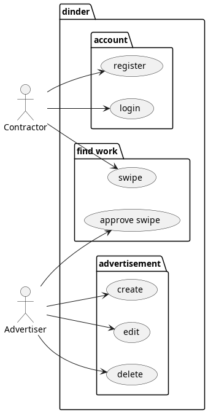
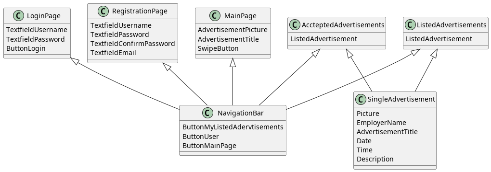
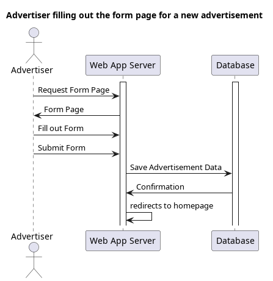
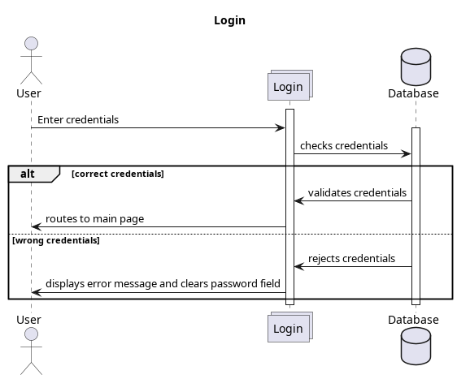
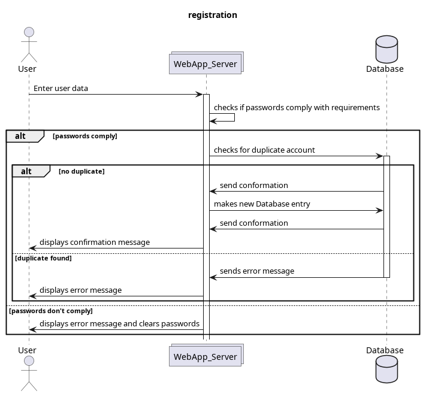
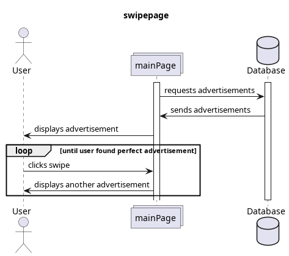
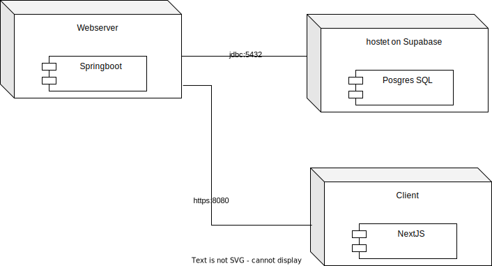
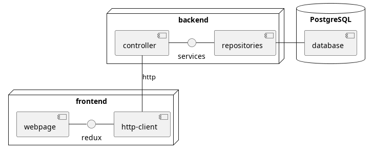
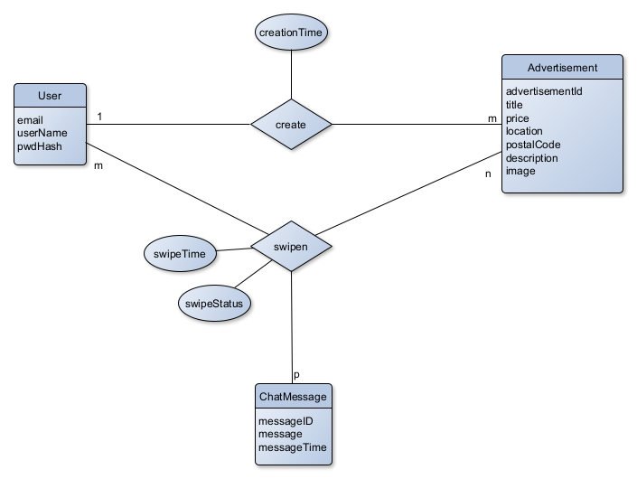

# SAD - Software Architecture Documentation

## 1. Introduction

### 1.1 Purpose

This document provides a comprehensive architectural overview of the system, using a number of different architectural
views to depict different aspects of the system. It is intended to capture and convey the significant architectural
decisions which have been made on the system.

### 1.2 Definitions, Acronyms, and Abbreviations

| Abbrevation | Explanation                         |
|-------------|-------------------------------------|
| SAD         | Software Architecture Documentation |
| UC          | Use-Case                            |
| UCRS        | Use-Case Realization Specification  |
| n/a         | not applicable                      |
| tbd         | to be determined                    |
| UCD         | overall Use Case Diagram            |
| FAQ         | Frequently asked Questions          |

### 1.3 References

| Title                                                                                               |    Date    | Publishing organization |
|-----------------------------------------------------------------------------------------------------|:----------:|-------------------------|
| [Dinder Blog](https://github.com/dhbw-ka-tinf22b5-dinder/Dinder/discussions/categories/projektblog) | 12.12.2023 | Dinder                  |
| [GitHub](https://github.com/dhbw-ka-tinf22b5-dinder/Dinder/)                                        | 12.12.2023 | Dinder                  |

### 1.4 Overview

- [1 Introduction](#1-introduction)
    - [1.1 Purpose](#11-purpose)
    - [1.3 Definitions, Acronyms, and Abbreviations](#12-definitions-acronyms-and-abbreviations)
    - [1.4 References](#13-references)
    - [1.5 Overview](#14-overview)
- [2 Architectural Representation](#2-architectural-representation)
- [3 Architectural Goals and Constraints](#3-architectural-goals-and-constraints)
- [4 Use-Case View](#4-use-case-view)
    - [4.1 Use-Case Realizations](#41-use-case-realizations)
- [5 Logical View](#5-logical-view)
    - [5.1 Overview](#51-overview)
    - [5.2 Architecturally Significant Design Packages](#52-architecturally-significant-design-packages)
- [6 Process View](#6-process-view)
- [7 Deployment View](#7-deployment-view)
- [8 Implementation View](#8-implementation-view)
    - [8.1 Overview](#81-overview)
    - [8.2 Layers](#82-layers)
- [9 Data View](#9-data-view-optional)
- [10 Size and Performance](#10-size-and-performance)
  - [10.1 Database and Backend](#101-database-and-backend)
  - [10.2 Frontend](#102-frontend)
- [11 Quality](#11-quality)

## 2. Architectural Representation

- Login Service: Handels Login & Registration
- User Service: Information about the User, Accepted & Offered Jobs
- Advertisement Service: Information about Advertisements (Picture, Title, Date, Description)
- Chat Service: Chat between Users detached from Advertisements (This feature was planned but is no longer possible as Lukas is no longer part of our team and there is not enough time to implement it.)

## 3. Architectural Goals and Constraints

Architectural Goals

- We want modularity so we can easily implement new features. We ensure this by using Springboot. With this framework we
  are able to easily create new api endpoints. OpenAPI and redoc then create an api-specification for the new endpoint
  automatically.
- The backend does all the logic while our frontend acts only as an interface to the api. Thus, we would also be able to
  create an Android or IOS-App very easily in the future.
- We currently don’t use test driven development, but we will write tests in the future

Constraints:

- We develop this as pure webapp timeframe till end of 4th semester.
- It is mandatory to use free tools and hosting providers.
- Our experience with building webprojects is limited

## 4. Use-Case View

### 4.1	Use-Case Realizations

UCRS for [advertisement](UCRS/advertisement.md) \
UCRS for [registration](UCRS/advertisement.md)

## 5. Logical View

### 5.1 Overview
Frontend

[Backend](images/Diagramme/Klassendiagramme/Backend.png)

### 5.2 Architecturally Significant Design Packages

Generally, we used the MVC pattern.

The webpage in the frontend represents the view. The controller classes in the backend corresponds to the
controller in the MVC pattern. The entity classes in the backend, as well as the repository classes
represent the model in the MVC pattern.

## 6. Process View

## 7. Deployment View

## 8. Implementation View

### 8.1 Overview

- Database
- backend
    - Since we use the MVC-pattern the backend handles the logic
    - It connects to the database using Hibernate
- frontend
    - It only displays the data given by the backend
    - It connects to the backend via http

### 8.2 Layers

- backend:
    - controller: endpoints of the api
    - services: handles logic
    - repositories: models the connection to the database
- frontend
    - http-client: sends requests for data to the backend
    - redux: saves the data in states
    - webpage: displays the data

## 9. Data View (optional)

## 10. Size and Performance

### 10.1 Database and Backend

The database and the backend needs to be available at all times. The response times need to be in a range to not impact
user interaction.
Both need to be extendable for future features. \
The performance of the backend might impact the overall response times the most, so optimizations are crucial here.

### 10.2 Frontend

The frontend should also be extendable to mirror the features made available by the backend. \
The performance needs to be very good since the user directly interacts with it.

## 11. Quality

- Extensibility:
    - modular design: We try to keep featrures seperated from each other, so we can easily modify them without changing
      everything
- Portability:
    - MVC-pattern: All the logic is in the backend, thus we only have to rewrite the frontend
    - NextJS: The frontend is written in NextJS with typescript. This helps to port the code to other typescript
      frontends like react-native.
    - Java: The backend can be executed on any system that has an available JVM implementation, meaning most modern OS.
- Security:
    - BCrypt: We use BCrypt for password encryption and decryption to prevent clear text passwords being stored in the
      database.
    - JWT: JWT tokens are used to identify the users authenticity by providing a signed JWT token inside a server-only
      cookie.
We describe how ensure the quality in a different document (link)
