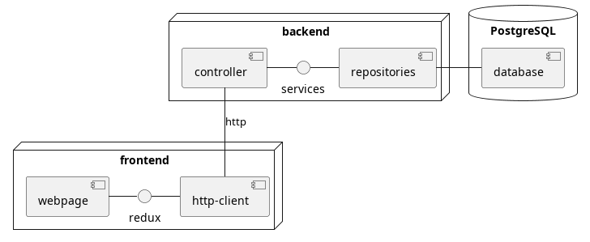

# SAD - Software Architecture Documentation

## 1.	Introduction
[The introduction of the Software Architecture Document provides an overview of the entire Software Architecture Document. It includes the purpose, scope, definitions, acronyms, abbreviations, references, and overview of the Software Architecture Document.]
###   1.1	Purpose
This document provides a comprehensive architectural overview of the system, using a number of different architectural views to depict different aspects of the system. It is intended to capture and convey the significant architectural decisions which have been made on the system.

[This section defines the role or purpose of the Software Architecture Document, in the overall project documentation, and briefly describes the structure of the document. The specific audiences for the document is identified, with an indication of how they are expected to use the document.]
### 1.2	Scope
[A brief description of what the Software Architecture Document applies to; what is affected or influenced by this document.]
### 1.3	Definitions, Acronyms, and Abbreviations
[This subsection provides the definitions of all terms, acronyms, and abbreviations required to properly interpret the Software Architecture Document.  This information may be provided by reference to the project’s Glossary.]
### 1.4	References
[This subsection provides a complete list of all documents referenced elsewhere in the Software Architecture Document. Identify each document by title, report number (if applicable), date, and publishing organization. Specify the sources from which the references can be obtained. This information may be provided by reference to an appendix or to another document.]
### 1.5	Overview

- [1 Introduction](#1-introduction)
  - [1.1 Purpose](#11purpose)
  - [1.2 Scope](#12scope)
  - [1.3 Definitions, Acronyms, and Abbreviations](#13definitions-acronyms-and-abbreviations)
  - [1.4 References](#14references)
  - [1.5 Overview](#15overview)
- [2 Architectural Representation](#2-architectural-representation)
- [3 Architectural Goals and Constraints](#3-architectural-goals-and-constraints)
- [4 Use-Case View](#4-use-case-view)
  - [4.1 Use-Case Realizations](#41use-case-realizations)
- [5 Logical View](#5-logical-view)
  - [5.1 Overview](#51overview)
  - [5.2 Architecturally Significant Design Packages](#52architecturally-significant-design-packages)
- [6 Process View](#6-process-view)
- [7 Deployment View](#7-deployment-view)
- [8 Implementation View](#8-implementation-view)
  - [8.1 Overview](#81overview)
  - [8.2 Layers](#82layers)
- [9 Data View](#9-data-view-optional)
- [10 Size and Performance](#10-size-and-performance)
- [11 Quality](#11-quality)

## 2.	Architectural Representation
[This section describes what software architecture is for the current system, and how it is represented. Of the Use-Case, Logical, Process, Deployment, and Implementation Views, it enumerates the views that are necessary, and for each view, explains what types of model elements it contains.]
## 3.	Architectural Goals and Constraints
[This section describes the software requirements and objectives that have some significant impact on the architecture; for example, safety, security, privacy, use of an off-the-shelf product, portability, distribution, and reuse. It also captures the special constraints that may apply: design and implementation strategy, development tools, team structure, schedule, legacy code, and so on.]
Architectural Goals
- We want modularity so we can easily implement new features. We ensure this by using Springboot. With this framework we are able to easily create new api endpoints. OpenAPI and redoc then create an api-specification for the new endpoint automatically.
- The backend does all the logic while our frontend acts only as an interface to the api. Thus we would also be able to create an Android or IOS-App very easily in the future.
- We currently don’t use test driven development but we will write tests in the future

Constraints:
- We develop this as pure webapp timeframe till end of 4th semester.
- We use React because we have the most experience in this framework.
- It is mandatory to use free tools and hosting providers.
- Our experience with building webprojects is limited

## 4.	Use-Case View
[This section lists use cases or scenarios from the use-case model if they represent some significant, central functionality of the final system, or if they have a large architectural coverage—they exercise many architectural elements or if they stress or illustrate a specific, delicate point of the architecture.]
### 4.1	Use-Case Realizations
[This section illustrates how the software actually works by giving a few selected use-case (or scenario) realizations, and explains how the various design model elements contribute to their functionality.]

## 5.	Logical View
[This section describes the architecturally significant parts of the design model, such as its decomposition into subsystems and packages. And for each significant package, its decomposition into classes and class utilities. You should introduce architecturally significant classes and describe their responsibilities, as well as a few very important relationships, operations, and attributes.]
### 5.1	Overview
[This subsection describes the overall decomposition of the design model in terms of its package hierarchy and layers.]
### 5.2	Architecturally Significant Design Packages
[For each significant package, include a subsection with its name, its brief description, and a diagram with all significant classes and packages contained within the package.
For each significant class in the package, include its name, brief description, and, optionally, a description of some of its major responsibilities, operations, and attributes.]
## 6.	Process View
[This section describes the system's decomposition into lightweight processes (single threads of control) and heavyweight processes (groupings of lightweight processes). Organize the section by groups of processes that communicate or interact. Describe the main modes of communication between processes, such as message passing, interrupts, and rendezvous.]

## 7.	Deployment View
This section describes one or more physical network (hardware) configurations on which the software is deployed and run. It is a view of the Deployment Model. At a minimum for each configuration it should indicate the physical nodes (computers, CPUs) that execute the software and their interconnections (bus, LAN, point-to-point, and so on.) Also include a mapping of the processes of the Process View onto the physical nodes.]
## 8.	Implementation View
[This section describes the overall structure of the implementation model, the decomposition of the software into layers and subsystems in the implementation model, and any architecturally significant components.]

### 8.1	Overview
[This subsection names and defines the various layers and their contents, the rules that govern the inclusion to a given layer, and the boundaries between layers. Include a component diagram that shows the relations between layers. ]
- Database
- backend
  - Since we use the MVC-pattern the backend handels the logic
  - It connects to the database with springboot
- frontend
  - It only displays the data given by the backend
  - It connects to the backend via http

### 8.2	Layers
[For each layer, include a subsection with its name, an enumeration of the subsystems located in the layer, and a component diagram.]
- backend:
  - controller : endpoints of the api
  - services : handles logic
  - repositories : connect to database
- frontend
  - http-client : sends requests for data to the backend
  - redux : saves the data in states
  - webpage : displays the data

## 9.	Data View (optional)
[A description of the persistent data storage perspective of the system. This section is optional if there is little or no persistent data, or the translation between the Design Model and the Data Model is trivial.]
## 10.	Size and Performance
[A description of the major dimensioning characteristics of the software that impact the architecture, as well as the target performance constraints.]
## 11.	Quality
[A description of how the software architecture contributes to all capabilities (other than functionality) of the system: extensibility, reliability, portability, and so on. If these characteristics have special significance, such as safety, security or privacy implications, they must be clearly delineated.]
- Extensibility :
  - modular design : We try to keep featrures seperated from each other, so we can easily modify them without changing everything
- portability :
  - MVC-pattern : All the logic is in the backend, thus we only have to rewrite the frontend
  - React : The frontend is written in react with typescript. This helps to port the code to other typescript frontends like react-native.
- security :

