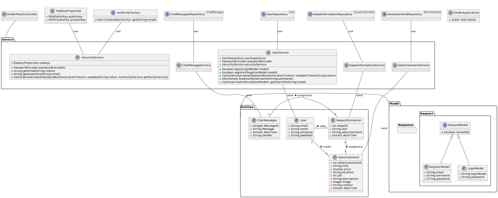
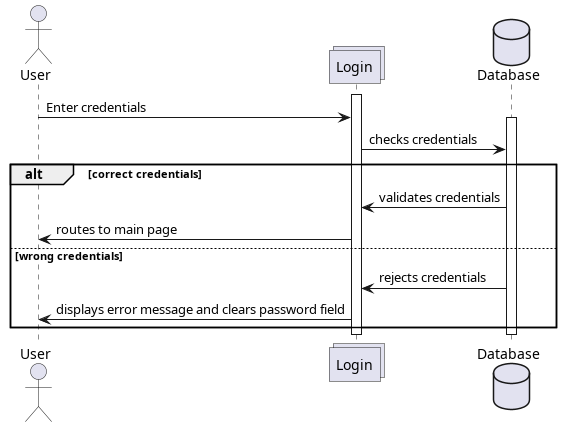
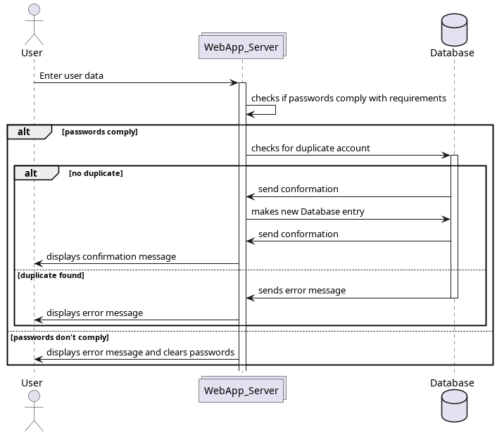
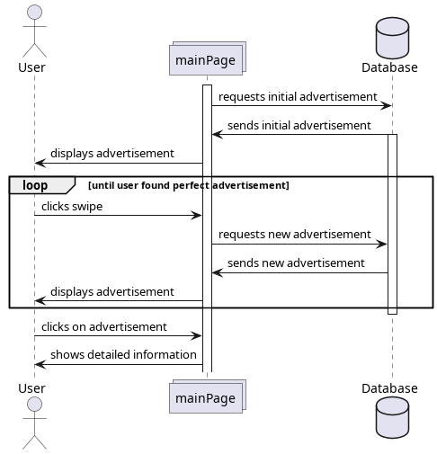

# SAD - Software Architecture Documentation

## 1. Introduction

### 1.1	Purpose

This document provides a comprehensive architectural overview of the system, using a number of different architectural
views to depict different aspects of the system. It is intended to capture and convey the significant architectural
decisions which have been made on the system.

### 1.2	Scope

This document defines the architecture of Dinder.

### 1.3	Definitions, Acronyms, and Abbreviations

| Abbrevation | Explanation                         |
|-------------|-------------------------------------|
| SAD         | Software Architecture Documentation |
| UC          | Use-Case                            |
| UCRS        | Use-Case Realization Specification  |
| n/a         | not applicable                      |
| tbd         | to be determined                    |
| UCD         | overall Use Case Diagram            |
| FAQ         | Frequently asked Questions          |

### 1.4	References

| Title                                                                                               |    Date    | Publishing organization |
|-----------------------------------------------------------------------------------------------------|:----------:|-------------------------|
| [Dinder Blog](https://github.com/dhbw-ka-tinf22b5-dinder/Dinder/discussions/categories/projektblog) | 12.12.2023 | Dinder                  |
| [GitHub](https://github.com/dhbw-ka-tinf22b5-dinder/Dinder/)                                        | 12.12.2023 | Dinder                  |

### 1.5	Overview

- [1 Introduction](#1-introduction)
    - [1.1 Purpose](#11purpose)
    - [1.2 Scope](#12scope)
    - [1.3 Definitions, Acronyms, and Abbreviations](#13definitions-acronyms-and-abbreviations)
    - [1.4 References](#14references)
    - [1.5 Overview](#15overview)
- [2 Architectural Representation](#2-architectural-representation)
- [3 Architectural Goals and Constraints](#3-architectural-goals-and-constraints)
- [4 Use-Case View](#4-use-case-view)
    - [4.1 Use-Case Realizations](#41use-case-realizations)
- [5 Logical View](#5-logical-view)
    - [5.1 Overview](#51overview)
    - [5.2 Architecturally Significant Design Packages](#52architecturally-significant-design-packages)
- [6 Process View](#6-process-view)
- [7 Deployment View](#7-deployment-view)
- [8 Implementation View](#8-implementation-view)
    - [8.1 Overview](#81overview)
    - [8.2 Layers](#82layers)
- [9 Data View](#9-data-view-optional)
- [10 Size and Performance](#10-size-and-performance)
- [11 Quality](#11-quality)

## 2. Architectural Representation

- Login Service: Handels Login & Registration
- User Service: Information about the User, Accepted & Offered Jobs
- Advertisement Service: Information about Advertisements (Picture, Title, Date, Description)
- Chat Service: Chat between Users detached from Advertisements

## 3. Architectural Goals and Constraints

Architectural Goals

- We want modularity so we can easily implement new features. We ensure this by using Springboot. With this framework we
  are able to easily create new api endpoints. OpenAPI and redoc then create an api-specification for the new endpoint
  automatically.
- The backend does all the logic while our frontend acts only as an interface to the api. Thus, we would also be able to
  create an Android or IOS-App very easily in the future.
- We currently don’t use test driven development, but we will write tests in the future

Constraints:

- We develop this as pure webapp timeframe till end of 4th semester.
- We use React because we have the most experience in this framework.
- It is mandatory to use free tools and hosting providers.
- Our experience with building webprojects is limited

## 4. Use-Case View

### 4.1	Use-Case Realizations

UCRS for [advertisement](../UCRS/advertisement.md) \
UCRS for [registration](../UCRS/advertisement.md)

## 5. Logical View

### 5.1	Overview

### 5.2	Architecturally Significant Design Packages

Generally, we used the MVC pattern.

The webpage in the frontend represents the view. The controller classes in the backend corresponds to the
controller in the MVC pattern. The entity classes in the backend, as well as the repository classes
represent the model in the MVC pattern.

## 6. Process View

## 7. Deployment View

We haven't completed a deployment so far, so we can't define anything specific here.\
What is needed is an environment on which a JVM can be run, together with internet access.

## 8. Implementation View

### 8.1	Overview

- Database
- backend
    - Since we use the MVC-pattern the backend handles the logic
    - It connects to the database using Hibernate
- frontend
    - It only displays the data given by the backend
    - It connects to the backend via http

### 8.2	Layers

- backend:
    - controller: endpoints of the api
    - services: handles logic
    - repositories: models the connection to the database
- frontend
    - http-client: sends requests for data to the backend
    - redux: saves the data in states
    - webpage: displays the data

## 9. Data View (optional)

## 10. Size and Performance

[A description of the major dimensioning characteristics of the software that impact the architecture, as well as the target performance constraints.]

## 11. Quality

[A description of how the software architecture contributes to all capabilities (other than functionality) of the system: extensibility, reliability, portability, and so on. If these characteristics have special significance, such as safety, security or privacy implications, they must be clearly delineated.]

- Extensibility :
    - modular design : We try to keep featrures seperated from each other, so we can easily modify them without changing
      everything
- portability :
    - MVC-pattern : All the logic is in the backend, thus we only have to rewrite the frontend
    - React : The frontend is written in react with typescript. This helps to port the code to other typescript
      frontends like react-native.
- security :

